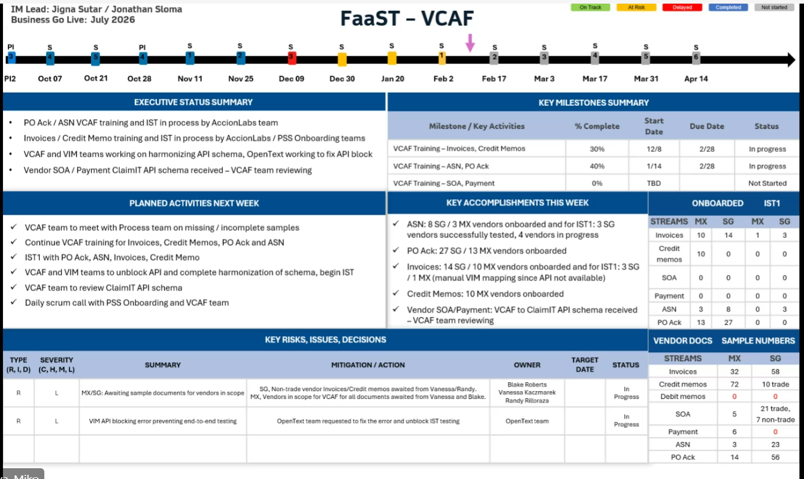

-
- Shared by Tzetzka on [[Project/Finance/FaaST/FaaST-VCAF]]
	- 
-
- # Meeting [[Project/XVantage in a Box/Nordics]] X4A for Nordics
	- ## Agenda
		- Nordics Unite Project (X4C/X4A/CRM/XVS)
			- Countries
			- Sweden
			- Norway
			- Denmark
			- Finland
	- ## Meeting notes
		- Kike currently coordinating efforts, will formalize group with kick-off
		- So far only X4C was in motion
		- X4A and CRM wasn't in the discussions yet
			- X4A and CRM will need to be part of the delivery
				- Associates will be able to create Cloud/Hybrid quotes/orders
			- a lot of additional requirements have been generated by business already, team will need to push back to take on only
		- Dependencies
			- X4A
				- countries already live
					- however dependency
						- on MFE modules
							- Subscriptions
							- OST
							- Invoice
						- OKTA authentication
			- CRM
				- X4A renovation work in CRM (Will try to descope)
					- CRM Profile
					- OST
					- Invoices
					- Subscriptions
				- X4C
				- XVS
		- Additional Notes
			- Norway is a setting branch of Sweden
			- Local seller of Record - Billing related only, no impact to our work
			- Pan Euro - yes, these countries  operate in Pan-Euro
			- Leadership expecation is targeting Q2 go-live
		- Out of MVP scope
			- Xi
			- ETO
			- Post-Order
	- ## Next Steps:
		- WAITING Sunny to provide an estimate on the time to roll out the base X4A instance
		- TODO  discuss with [[Enrique Saul]]
			- TODO What is X4C Vanilla ?
			- TODO What is X4A renovation or something like that ?
			- TODO **Important note** Norway business I believe is still small we should split them with this project already to avoid bigger migration requirements later !!
-
- # Meeting [[Revathi Murali]]
	- ## topics discussed
		- She is the project manager for [[Project/Finance/Credit Engine]] & [[Project/Finance/Deal Analyzer]]
		- Current releases :
			- Credit engine MVP > CA, SG, DE > UAT as of next week 16/02 CA DE, SG 23/2
				- MX we will needed FaaST No ETA yet.
				- Jira Epics :
			- Deal Analyzer
				- Already live in US, CA & MIExp
				- There is a rework done to make Deal Analyzer available via X4A
					- Will be first rolled out to US, CA and MI then to ROW.
						- [Deal Analyzer roll out plan 2026](https://ingrammicro.sharepoint.com/:p:/r/sites/OG-GlobalCredit-Dealapprovals-Multiyear_perioddeals/Shared%20Documents/Deal%20approvals-Multiyear_period%20deals(MYD)/Project%20Management/Decks/DA%20Rollout%20plan%202026.pptx?d=w1d9242a9b7104ae99a2628b39d16fc98&csf=1&web=1&e=Hx20h4)
				-
-
- # Meeting [[Tzetzka Dimova]]
	- Agenda :
		- How to get the finance deliveries under control
	- Attendees :
		- A1
		- A2
	- ## Discussed
		- Fin Ops is :
			- [[Charlotta Hollen]] Process Governance
				- FaaST
					- Project manager FaaST : Rebecca Ellis
				- Credit Engine & Deal Analyzer
					- Project Manager Credit Engine & Deal Analyzer : Revathi Murali
			- [[Tzetzka Dimova]] Global Finance Operations & Process
				- FIT Team (Testing Finance)
					- FaaST
						- AP : Margaret Trolli
						- AR : Wendy Palmer
						- GL + : Monica Duncan
					- Credit Engine & Deal Analyzer
						- Wendy Palmer
				- Global Process
					- [[Wenny Solorio]] > include her with everything that is XVS related
						- Epic read outs
						- Design reviews
						- Product release demo's
					- Kamini Janardi > XVS3.0 with SAP PS1
					- Kelly Rucker > Deal Analyzer
		- Finance Engineering : [[Ajit Chintapalli]]
			- FaaST, Credit Engine and Deal Analyzer ?
			- RTE : [[Vivek Mishra]]
			-
		- To include for XVS :
			-
			-
			-
			-
		- T2
	- ## Next Steps
		- S1
		- S2
	- ## Action items
		- P1
			- A1
			- A2
		- P2
			- A1
			- A2